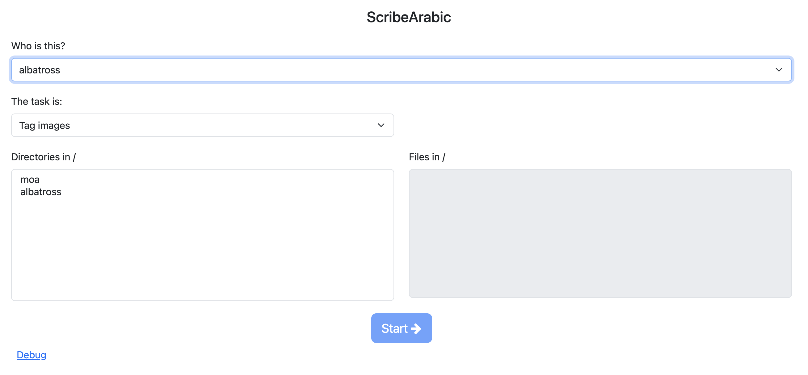
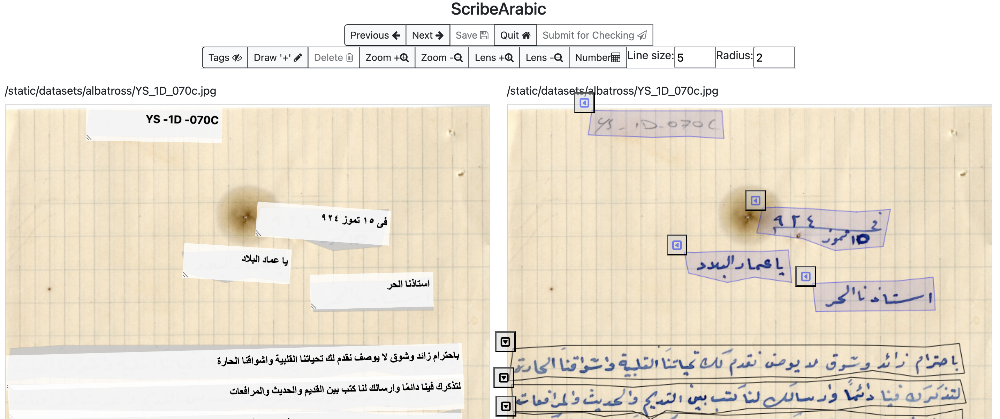
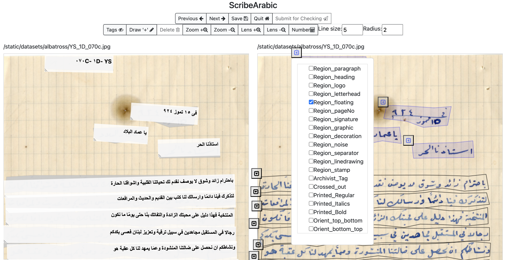

# Annotation Tool Manual

## Table of Contents

- Urls
  - [home](#home)
  - [starttagging](#starttagging)
  - [check](#check)
  - [enter](#enter)
  - [upload](#upload)
- [Start Annotating](#start-annotating)
- [Annotation Process](#annotation-process)
  - [Move an Annotation](#move-an-annotation)
  - [Editing an Annotation](#editing-an-annotation)
  - [Tagging an annotation](#tagging-an-annotation)
- [Button Descriptions](#button-descriptions)

## home

`localhost:8000/home`

For only annotations and transcriptions. For each image a corresponding \_annotate_user would be created. Multiple users can have different annotations and transcriptions for the same file and so we recommend that each user's task images should be in a separate directory. Once the images are transcribed, they can be submitted for QA using the "Submit for Checking" button. The image and its annotation file is moved to a <user>\_submitted directory.

## starttagging

`localhost:8000/starttagging`

For adding various region tags to the images. Through this option, the users can also carry out annotation and transcriptions. It is kept separate, in case the team tagging page elements is different from the team transcribing images.

## check

`localhost:8000/check`

For QA. The homescreen allows the user to select a "usertoverify" and check their transcriptions. Once checked, the 'Done checking' moves the file and its annotation to the <user>\_checked directory.

## enter

`localhost:8000/enter/{username}`

This is a shortcut for annotating images. If a user is already created and a directory with the user's name exists, then this option takes the user to the image folder having the user's annotation files in that particular directory. For example /enter/moa will take the user directly to the annotation screen for annotating images in moa directory.

## upload

`localhost:8000/upload`

If you have new images that you would like to upload you can use the upload url. You can choose a particular user you want to add the images for. Then those images will be available for annotation.

## Start Annotating

An annotation is a transcription of an image of text and can also be tagged.

Once you have the server running using the [readme.md](readme.md), you can visit this url: http://localhost:8000/starttagging

The browser will open a page as shown: 

Once you choose the user and task (only one option), you can select a directory from the left box. The image files in the directory will appear in the right box. You can also select a set of image files on the right to annotate. Clicking the blue start button will take you to the annotation screen. If no file is selected, the annotation screen will allow the annotation and transcription of all files.

## Annotation Process

The annotation page is shown here: 

You can draw the annotations in the right window and transcribe in the left window. You can also tag page elements in the right window.

To draw an annotation please see the `Draw` button explanation in [Button Descriptions](#Button-descriptions)

## Move an Annotation

Single clicking an annotation enables the select mode and the user can move the annotation using the mouse.

## Editing an Annotation

Double clicking an annotation enables the edit mode and the user can edit the annotation using the mouse.

In edit mode the `-` key deletes a control point and the `p` key adds a control point

## Tagging an annotation

A tag for an annotation gives more information about what the annotation contains. This can be information such as whether the text is part of a heading or is a page number etc.

To tag an annotation click the box on the top left of a shape to tag it with info such as Region_heading or Region_floating. The tags that are available can be modified using a config file.

## Button Descriptions

`Prev` and `Next` cycle through the images in the directory

`Save` to save the current image annotation

`Quit` to exit the annotation page

`Submit for Checking` to mark an image as done. Once clicked, the image and its annotation moves to a new (or existing) directory with \_submitted prefix. For example, if a user was working in the moa directory, then the files would be moved to moa_submitted.

`Tags` to toggle whether the tags for an annotation box are visible

`Draw` to create a polygon bounding area around the text line

- Click on draw and then start drawing by clicking on the page on the right
- A single click adds another control point
- Double click to finish drawing the shape (it will close automatically)
- Click on a shape to move it
- Click on a shape to `Delete` it or use the Backspace or Delete key on the keyboard
- Click the box on the top left of a shape to tag it with info such as Region_heading or Region_floating
- On the left side of the page you can see that your box creates a text box to transcribe. You can write down the text that is in the box that you drew. You can right click on the text box and change the writing direction to either left to right or right to left.

`Zoom In/Out` to zoom

`Lens` to magnify what you are hovering over

`Number` to convert the numbers in the text boxes that have been transcribed to arabic

`Line Size` to set the size of the line when you are drawing using the draw button

`Radius` to set the size of the control points when you are drawing using the draw button
